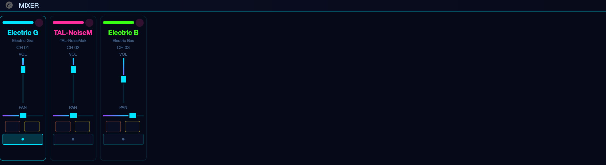
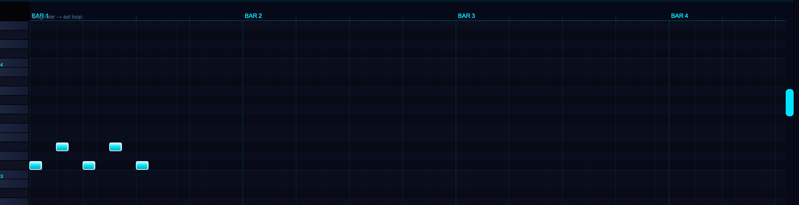
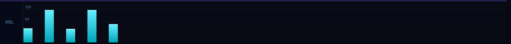

# SBS-Synth Master

A full-featured Digital Audio Workstation built with a **C++ audio core** and a **PySide6 GUI layer**. MIDI sequencing, multi-track mixing, a timeline arranger, a step sequencer, a channel rack, per-track C++ DSP effects, full-project offline mastering export, a real-time master bus with audition modes, AI-assisted tools, and live keyboard / gamepad input — all in one application.

---

## Screenshots

### Mixer


### Piano Roll


### Velocity Editor


---

## Architecture

```
┌─────────────────────────────────────────────────────────┐
│                   PySide6 GUI Layer                     │
│  MainWindow · PianoRoll · Mixer · Transport · Panels    │
└────────────────────────┬────────────────────────────────┘
                         │  pybind11 bindings
┌────────────────────────▼────────────────────────────────┐
│              C++ daw_processors Extension               │
│  MasterBus · AuditionProcessor · BrickwallLimiter       │
│  AutomationProcessor · FullProjectRenderer · Sampler    │
│  40+ DSP processors (compressor, EQ, reverb, …)         │
└────────────────────────┬────────────────────────────────┘
                         │
┌────────────────────────▼────────────────────────────────┐
│           FluidSynth / pygame / pedalboard              │
│       SoundFont synthesis · pygame audio output         │
│           pedalboard FX chains · VST hosting            │
└─────────────────────────────────────────────────────────┘
```

**Design rule:** all audio processing and DSP run in C++ (GIL released via `py::call_guard<py::gil_scoped_release>()`). Python is strictly the GUI and orchestration layer.

---

## Features

### Core MIDI & Sequencing

| Feature | Description |
|---|---|
| **Multi-Track MIDI** | Up to 16 instrument channels, each with its own SoundFont patch, volume, pan, reverb, mute, and solo |
| **Piano Roll** | Click-and-drag to draw notes; right-click to erase; scroll to navigate; active track vivid, others shown as ghost notes |
| **Velocity Editor** | Per-note velocity bars rendered below the piano roll; chord notes shown side-by-side with pitch labels |
| **Live Recording** | Play keys in real time and capture notes with beat-accurate timing |
| **Step Sequencer / Channel Rack** | 16-step pattern grid for drum and melodic patterns; patterns loop continuously alongside timeline clips |
| **Clip-Based Arrangement** | MIDI and audio clips placed on a scrollable timeline; drag to reposition, right-click to delete |
| **Grid Snap** | Configurable quantise grid (1/4, 1/8, 1/16, 1/32 note, triplets); visual grid lines in the arrange view |
| **Velocity Humanizer** | Gaussian-distributed velocity and timing micro-variation for natural-sounding playback (C++ `VelocityHumanizer`) |

### Audio Tracks & Import

| Feature | Description |
|---|---|
| **Audio File Tracks** | Import WAV, MP3, FLAC, OGG clips onto the timeline; each clip shows a waveform thumbnail |
| **Waveform Display** | Peak data generated by C++ `WaveformGenerator` for accurate clip previews at any zoom level |
| **Multi-Format Import** | `ImportManager` detects audio vs. MIDI files automatically; drag-and-drop from the file system |
| **Per-Clip DSP** | Each audio track has its own `AudioFxChain`; processed offline before playback via *pedalboard* |

### Mixing & Signal Routing

| Feature | Description |
|---|---|
| **MIDI Mixer Strips** | Volume fader, pan slider, mute, solo, FX button, instrument selector — one strip per MIDI channel |
| **Audio Mixer Strips** | Identical strip layout for audio file tracks; separate gain staging (0–200 %) |
| **Automation Lanes** | Per-track automation curves drawn directly in the arrange view; piecewise-linear interpolation; parameters: volume, pan, any FX plugin parameter |
| **Real-Time Loudness Automation** | C++ `LoudnessAutomation` (RMS analyser + envelope follower + PID controller) keeps integrated loudness on target during playback |
| **Spectral Panning** | C++ `SpectralPanningProcessor` — frequency-dependent stereo positioning via FFT; unique spatial field per frequency band |

### Master Bus

| Feature | Description |
|---|---|
| **C++ MasterBus** | Real-time stereo sum bus; `add_track()` / `process()` run entirely in C++ with the Python GIL released |
| **Master Gain** | Continuous gain control 0–+6 dB applied before the limiter stage |
| **BrickwallLimiter** | Embedded C++ limiter with Catmull-Rom true-peak inter-sample detection; configurable ceiling and timing |
| **Stereo VU Meter** | Dual-channel peak meter with dBFS gradient (cyan → orange → pink); 20 Hz GUI polling; instant-attack / 200 ms decay hold |
| **Audition Mode: Mix** | Normal path — user gain + user limiter; full creative control |
| **Audition Mode: Preview (-7 LUFS)** | Intercepts the normal chain; routes through a hardcoded C++ `AuditionProcessor` (+7 dB pre-gain, −1.0 dBFS true-peak ceiling, 50 ms release) |
| **Audition Mode: Streaming (-14 LUFS)** | Intercepts the normal chain; routes through a dedicated `AuditionProcessor` (0 dB pre-gain, −1.0 dBFS TP ceiling, 150 ms release — transparent streaming limiter) |
| **Thread-Safe Mode Switching** | `set_audition_mode()` writes a `std::atomic<int>` from the GUI thread; audio thread picks it up within one block with zero dropout |

### C++ DSP Effects (daw_processors)

All processors compiled as a single `daw_processors` pybind11 extension; every `process()` call releases the Python GIL.

| Category | Processors |
|---|---|
| **Dynamics** | BrickwallLimiter · MultibandCompressor · DynamicEQ · DeEsser · TransientShaper · GateExpander |
| **Spatial / Time** | DelayEcho · Flanger · Phaser · StereoImager |
| **Harmonic / Character** | Saturation · Overdrive · Bitcrusher · Exciter |
| **Filter / Pitch** | AutoFilter · PitchCorrector · PitchShifter |
| **Sampler** | Sampler (offline wavetable, polyphonic) |
| **Metering / Analysis** | RmsAnalyzer · SpectralAnalyzer · EnvelopeFollower · WaveformGenerator |
| **Loudness** | LoudnessAutomation (RMS + PID) |
| **Panning** | SpectralPanningProcessor · SpectralMaskingManager |
| **Grid / Timing** | GridSnapper · QuantizeEngine · TimelineRuler · AudioLoopScheduler |
| **Humanization** | VelocityHumanizer · GaussianRng · TimingWeightFunction |
| **Render Pipeline** | AutomationProcessor · FullProjectRenderer · OfflineExporter · MasterBus · AuditionProcessor |

Pure-Python fallbacks (matching the same API) are provided for every C++ class so the application runs without a compiled extension.

### Export & Mastering

| Feature | Description |
|---|---|
| **Multi-Format Mastering Export** | One-click export dialog offering four simultaneous targets |
| **Preview MP3** | −7 LUFS · 320 kbps · heavy limiting — commercial release loudness |
| **Streaming WAV** | −14 LUFS · −1 dBFS true peak · 24-bit — Spotify / Apple Music compliant |
| **Lease WAV** | −3 dBFS peak · 24-bit — headroom-preserved beat lease |
| **Trackout Stems** | Per-track 24-bit WAV files (MIDI stems via FluidSynth; audio stems with FX applied) |
| **Full Project Offline Render** | One FluidSynth pass for all MIDI channels + step-sequencer events; per-track audio decode with FX chains; everything summed via C++ `FullProjectRenderer` with per-frame automation |
| **Per-Frame Automation** | C++ `AutomationProcessor` (binary-search piecewise linear) provides sample-accurate volume and pan curves during export |
| **Progress Tracking** | `MasteringExportWorker` (QThread) emits live progress and status signals; cancellable at any point |
| **LUFS Measurement** | pyloudnorm primary; RMS + 3.5 dB offset fallback |
| **Simple WAV / MP3 Export** | Legacy single-format export for quick bounces |

### AI Tools

| Feature | Description |
|---|---|
| **AI Smart EQ** | Analyses frequency content and suggests per-band EQ settings |
| **AI Generative Reverb** | Generates reverb impulse responses tuned to the project context |
| **AI Smart Master** | One-click AI mastering pipeline |
| **AI Stem Splitter** | Source-separation to split an audio file into instrument stems |

### Timeline & Navigation

| Feature | Description |
|---|---|
| **Track Arrange View** | Scrollable timeline with MIDI clips and audio clips; zoom with mouse wheel |
| **Audio Loop Scheduler** | C++ `AudioLoopScheduler` computes precise loop boundary positions for glitch-free looping |
| **Timeline Engine** | C++ `TimelineEngine` tracks playback position and fires clip-start callbacks |
| **Project Manager** | Save and load the full project state (tracks, clips, automation, FX chain settings) |

### Input Devices

| Feature | Description |
|---|---|
| **QWERTY Keyboard** | Three rows of keys map to a musical scale; layout rebuilds when scale or root changes |
| **PS5 DualSense** | 8 face / shoulder buttons → scale degrees; Options = play/stop; Share = record |
| **Scale & Root Selector** | Major, Minor, Pentatonic, Blues, Chromatic — all key mappings rebuild instantly |
| **Panic Button** | Silences every note on every channel immediately |

### UI & Workflow

| Feature | Description |
|---|---|
| **Bioluminescent Dark Theme** | Deep-black backgrounds with glowing cyan and hot-pink neon accents; consistent across all panels |
| **Humanizer Panel** | GUI for the C++ `VelocityHumanizer`; per-track Gaussian spread and timing jitter controls |
| **Grid Settings Panel** | Visual grid resolution picker with live preview |
| **Instrument Preview** | Audition any GM patch before assigning it to a track |
| **FX Rack Widget** | Drag-and-drop insert effect slots; each slot shows the C++ processor name, bypass toggle, and parameter controls |
| **FX Slot Widget** | Individual plugin slot with expand / collapse parameter view |

---

## Installation

### Prerequisites

**Windows (primary)**

```powershell
# Python 3.11+
winget install Python.Python.3.11

# FluidSynth (required for MIDI synthesis)
# Download installer from https://www.fluidsynth.org/ and add to PATH

# C++ build tools (required to compile daw_processors)
# Install Visual Studio Build Tools 2022 with "Desktop development with C++"
# CMake 3.18+ and pybind11 also required
```

**macOS**

```bash
brew install fluid-synth python@3.11 cmake pybind11
```

### Clone and install Python dependencies

```bash
git clone https://github.com/JulianWIAI/daw_light_version.git
cd daw_light_version
python -m venv venv
# Windows:
venv\Scripts\activate
# macOS/Linux:
source venv/bin/activate

pip install -r requirements.txt
```

### Build the C++ daw_processors extension (recommended)

```powershell
# Windows (PowerShell)
cd cpp_processors
.\build_win.ps1
```

```bash
# macOS / Linux
cd cpp_processors
pip install .
```

The C++ extension provides GIL-free real-time DSP. If compilation fails the app falls back to pure-Python equivalents automatically — all features remain functional.

### Optional dependencies

```bash
# MP3 export (Windows: install ffmpeg and add to PATH)
# macOS: brew install ffmpeg

# VST3 / Audio Unit plugin hosting
pip install pedalboard sounddevice

# AI tools
pip install torch torchaudio demucs
```

### Add a SoundFont

Download a free General MIDI SoundFont (e.g. **GeneralUser GS** or **FluidR3 GM**) and place the `.sf2` file in `assets/soundfonts/`. The app discovers it automatically on startup.

### Run

```bash
python main.py
```

---

## Keyboard Controls

| Keys | Action |
|---|---|
| `Z X C V B N M , . /` | Scale degrees, lowest octave |
| `A S D F G H J K L ; '` | Scale degrees, middle octave |
| `Q W E R T Y U I O P [ ]` | Scale degrees, highest octave |
| `Space` | Play / Stop |

---

## PS5 DualSense Mapping

| Button | Scale Degree | Example (C Major) |
|---|---|---|
| Cross (✗) | Root | C |
| Circle (○) | 2nd | D |
| Square (□) | 3rd | E |
| Triangle (△) | 4th | F |
| L1 | 5th | G |
| R1 | 6th | A |
| L2 | 7th | B |
| R2 | Octave | C (high) |
| Options | Play / Stop | — |
| Share | Record | — |

Connect via USB or Bluetooth, then click **Connect Gamepad** in the toolbar.

---

## Mastering Export Targets

Click **🎚 MASTER** in the toolbar to open the export dialog.

| Target | Loudness | Peak | Format | Use case |
|---|---|---|---|---|
| Preview MP3 | −7 LUFS | — | 320 kbps MP3 | Social media, SoundCloud, YouTube |
| Streaming WAV | −14 LUFS | −1 dBFS TP | 24-bit WAV | Spotify, Apple Music, Tidal |
| Lease WAV | — | −3 dBFS | 24-bit WAV | Beat lease / licence delivery |
| Trackout Stems | — | −3 dBFS | 24-bit WAV per track | Producer stems delivery |

The same offline render (FluidSynth + audio clips + automation) feeds all four targets simultaneously. Each target applies its own mastering chain (gain normalisation → BrickwallLimiter → dither where applicable).

---

## Audition Modes

The **MASTER** strip in the mixer has three real-time audition modes accessible from the [MIX] / [PREV] / [STRM] button group:

| Mode | Button | Processing | Purpose |
|---|---|---|---|
| Mix (Bypass) | MIX | User gain + user BrickwallLimiter | Normal creative mixing |
| Preview (-7 LUFS) | PREV | +7 dB pre-gain → C++ AuditionProcessor → −1 dBFS TP | Hear how the mix sounds at commercial streaming loudness |
| Streaming (-14 LUFS) | STRM | 0 dB pre-gain → C++ AuditionProcessor → −1 dBFS TP | Hear the reference streaming level |

Switching modes writes a `std::atomic<int>` from the GUI thread — no locks, no dropouts, the audio thread picks it up within one block.

---

## Project Structure

```
daw_light_version/
├── main.py                          # Entry point
├── requirements.txt
├── assets/
│   ├── icons/
│   ├── soundfonts/                  # Drop .sf2 files here
│   └── screenshots/
├── cpp_processors/                  # C++ DSP extension (daw_processors)
│   ├── include/                     # 42 C++ headers
│   │   ├── MasterBus.h              # Real-time sum bus + audition routing
│   │   ├── AuditionProcessor.h      # Per-mode loudness processor + AuditionMode enum
│   │   ├── BrickwallLimiter.h       # True-peak look-ahead limiter
│   │   ├── AutomationProcessor.h    # Sample-accurate piecewise-linear curves
│   │   ├── FullProjectRenderer.h    # Offline stereo mix bus
│   │   ├── MultibandCompressor.h
│   │   ├── DynamicEQ.h
│   │   └── ...                      # 36 more processor headers
│   ├── src/                         # 38 .cpp files + bindings.cpp
│   │   ├── MasterBus.cpp
│   │   ├── AuditionProcessor.cpp
│   │   ├── FullProjectRenderer.cpp
│   │   ├── bindings.cpp             # pybind11 module entry point
│   │   └── ...
│   ├── CMakeLists.txt
│   └── build_win.ps1
└── core/                            # Python application layer
    ├── gui_windows.py               # MainWindow — all UI panels wired together
    ├── audio_engine.py              # FluidSynth wrapper
    ├── midi_logic.py                # Sequencer — tracks, clips, recording, playback
    ├── audio_file_player.py         # pygame-based multi-track audio playback
    ├── automation_lane.py           # AutomationEnvelope + AutomationPanel widget
    ├── channel_rack.py              # Step-sequencer channel rack
    ├── audio_fx_chain.py            # Per-track C++ plugin chain
    ├── audio_fx_panel.py            # FX chain GUI panel
    ├── fx_rack_widget.py            # Insert effect rack widget
    ├── fx_slot_widget.py            # Single FX slot widget
    ├── fx_plugin_base.py            # Plugin base class
    ├── fx_plugin_registry.py        # Plugin discovery and instantiation
    ├── fx_plugins_cpp.py            # C++ DSP node wrappers (dynamics, spatial, …)
    ├── fx_plugins_filter.py         # Filter plugin wrappers
    ├── fx_plugins_harmonic.py       # Saturation / overdrive / exciter wrappers
    ├── fx_plugins_loudness.py       # LoudnessAutomation wrapper
    ├── fx_plugins_pedalboard.py     # pedalboard-based plugin wrappers
    ├── fx_plugins_pitch.py          # PitchCorrector / PitchShifter wrappers
    ├── fx_plugins_sampler.py        # Sampler plugin wrapper
    ├── fx_plugins_spatial.py        # StereoImager / DelayEcho wrappers
    ├── fx_plugins_spectral_panning.py # SpectralPanningProcessor wrapper
    ├── audio_mixer_strip.py         # Audio track mixer strip widget
    ├── master_bus_channel.py        # MasterBusChannel strip widget (VU + audition)
    ├── master_bus_python.py         # C++ MasterBus fallback + factory
    ├── export_dialog.py             # Multi-format mastering export dialog
    ├── mastering_export_worker.py   # QThread mastering render worker
    ├── project_render_info.py       # Immutable render snapshot dataclasses
    ├── project_render_pipeline.py   # Full offline render orchestrator
    ├── automation_processor_python.py  # AutomationProcessor Python fallback
    ├── full_project_renderer_python.py # FullProjectRenderer Python fallback
    ├── grid_snapper_python.py       # GridSnapper Python fallback
    ├── velocity_humanizer_python.py # VelocityHumanizer Python fallback
    ├── loudness_automation_python.py   # LoudnessAutomation Python fallback
    ├── spectral_panning_python.py   # SpectralPanningProcessor Python fallback
    ├── waveform_peaks_python.py     # WaveformGenerator Python fallback
    ├── audio_loop_scheduler_python.py  # AudioLoopScheduler Python fallback
    ├── sampler_python.py            # Sampler Python fallback
    ├── offline_exporter_python.py   # OfflineExporter Python fallback
    ├── timeline_engine_bridge.py    # TimelineEngine Python bridge
    ├── instrument_renderer.py       # Offline instrument render helper
    ├── instrument_preview.py        # Instrument audition widget
    ├── rack_sampler_engine.py       # Channel rack sampler engine
    ├── import_manager.py            # File import + format detection
    ├── project_manager.py           # Project save / load
    ├── humanizer_panel.py           # Velocity humanizer GUI panel
    ├── grid_settings_panel.py       # Grid resolution GUI panel
    ├── export_worker.py             # Legacy single-format export worker
    ├── ai_smart_eq.py               # AI EQ assistant
    ├── ai_generative_reverb.py      # AI reverb generator
    ├── ai_smart_master.py           # AI mastering pipeline
    ├── ai_stem_splitter.py          # AI source separation (Demucs)
    ├── controller.py                # QWERTY + DualSense input mediator
    ├── effects.py                   # Legacy MIDI per-track effects chain
    └── vst_engine.py                # VST3 / AU plugin host
```

---

## Dependencies

| Package | Purpose |
|---|---|
| `PySide6` | Qt6 GUI framework |
| `pyfluidsynth` | FluidSynth bindings for MIDI synthesis |
| `pygame` | Gamepad input + multi-channel audio output |
| `mido` | MIDI file I/O |
| `python-rtmidi` | External MIDI device support |
| `numpy` | Audio buffer arithmetic |
| `scipy` | Signal processing utilities |
| `pyloudnorm` | LUFS loudness measurement for export targets |
| `soundfile` | WAV / FLAC read-write |
| `pedalboard` *(optional)* | VST3 / Audio Unit plugin hosting + audio file I/O |
| `sounddevice` *(optional)* | Audio device I/O |
| `pybind11` | C++ → Python binding (build-time only) |
| `torch` / `torchaudio` / `demucs` *(optional)* | AI stem splitting |

---

## License

MIT — free for personal, educational, and commercial use.

*Built for a school project — SBS Studio, 2026.*

---

## AI Disclosure

This project was developed in cooperation with AI assistance (Claude by Anthropic). AI was used to help design architecture, generate boilerplate, debug logic, and refine documentation. All creative decisions, feature design, and final code review were done by the author.
